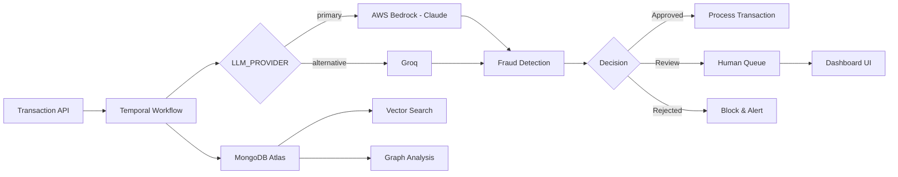

# AI-Powered Transaction Processing System – Proof of Value

Enterprise-grade financial fraud detection system that combines MongoDB Atlas vector search, Temporal workflows, and AWS Bedrock AI to demonstrate real-time transaction analysis and intelligent fraud detection capabilities.

 

## Quick Start

```bash
# 1. Clone the repository
git clone https://github.com/mongodb-partners/mongodb-temporal-ai-agent-qs.git
cd mongodb-temporal-ai-agent-qs

# 2. Configure environment (minimal setup)
cp .env.example .env
# Edit .env with your MongoDB Atlas URI and AWS credentials

# 3. Run quick setup (creates venv, installs deps, starts Temporal on Docker and launch the app)
./scripts/quick_setup.sh

# or Run docker setup (Deploy everything on Docker and launch the app)
./scripts/docker_setup.sh
```

## Table of Contents

- [Overview](#overview)
- [Business Value & Use Cases](#business-value--use-cases)
- [Architecture](#architecture)
- [Installation & Configuration](#installation--configuration)
- [Usage](#usage)
- [Evaluation Guide](#evaluation-guide)
- [Troubleshooting](#troubleshooting)
- [Next Steps](#next-steps)
- [License](#license)

## Overview

**What It Does:** Processes financial transactions through an AI-powered decision pipeline that combines rule-based evaluation, vector similarity search, and advanced fraud detection to provide real-time approve/reject decisions with detailed reasoning.

**Business Value:**
- ✅ **Advanced fraud detection** through hybrid AI + vector search approach
- ✅ **Reduced operational costs** via automated transaction processing
- ✅ **Fast decision processing** with asynchronous workflows
- ✅ **Decreased manual review workload** through AI-assisted decisions
- ✅ **Complete audit trails** with explainable AI reasoning

**PoV Scope Limitations:**
- Mock data for demonstration (no real financial data)
- Single-region deployment (production would be multi-region)
- Performance not optimized for high throughput
- Basic notification system
- Simplified compliance checks (production requires full KYC/AML)

## Business Value & Use Cases

### Primary Scenarios Demonstrated

1. **Fraud Ring Detection** - Identifies coordinated criminal networks through graph traversal
2. **Real-time Risk Scoring** - AI-powered analysis with confidence scoring
3. **Automated Compliance** - Sanctions screening and regulatory checks
4. **Human-in-the-Loop** - Escalation workflows for complex cases
5. **Cost Optimization** - Reduces manual review while maintaining accuracy

### Expected Measurable Outcomes (KPIs)

| Metric | Description | PoV Demonstrates |
|--------|-------------|------------------|
| Detection Capability | AI-powered analysis | Multi-factor risk assessment |
| Processing Speed | Workflow execution time | Asynchronous processing |
| Auto-Approval | Transactions approved without manual review | Confidence-based decisions |
| Manual Review | Human-in-the-loop capability | Queue management system |
| Audit Trail | Decision tracking | Complete workflow history |

### Enterprise Alignment

- **MongoDB Atlas Integration:** Demonstrates vector search, ACID transactions, and aggregation pipelines
- **AI Workflow Orchestration:** Shows Temporal's reliability for mission-critical processes
- **Cloud-Native Architecture:** Ready for AWS/Azure/GCP deployment
- **Regulatory Compliance:** Built-in audit trails and explainability

## Architecture

### High-Level System Flow



### Key Components (PoV Scope)

- **FastAPI Backend** - REST API for transaction submission
- **Temporal Worker** - Durable workflow execution engine
- **MongoDB Atlas** - Document store with vector search capabilities
- **AWS Bedrock** - Claude for transaction analysis (primary LLM provider)
- **Groq** - Alternative LLM provider (selectable via `LLM_PROVIDER`)
- **Voyage AI** - Finance-optimized embeddings (primary embedding provider, 1024 dims)
- **AWS Bedrock + Cohere** - Embedding fallback when Voyage is unavailable
- **Streamlit Dashboard** - Real-time monitoring and review interface

### Integration Points

- MongoDB Atlas with 1024-dimensional vector indexes
- Temporal for workflow orchestration and retry logic
- AWS Bedrock API for AI inference
- RESTful APIs for external system integration

For detailed architecture documentation, see [docs/ARCHITECTURE.md](docs/ARCHITECTURE.md).

## Installation & Configuration

### Prerequisites

- Python 3.13+
- [uv](https://docs.astral.sh/uv/) for dependency management
- Docker & Docker Compose
- MongoDB Atlas account (free tier works)
- AWS account with Bedrock access (Claude + Cohere)
- Voyage AI API key (recommended for finance-optimized embeddings)
- Groq API key (optional, for Groq LLM provider)
- 8GB RAM minimum

### Quick Setup (Docker)

```bash
# Start Temporal infrastructure (separate compose file)
cd docker-compose && docker compose up -d && cd ..

# Start application services (API, worker, dashboard)
docker compose up -d

# Verify services are running
docker compose ps
curl http://localhost:8000/health
```

### Local Development Setup

This project uses [`uv`](https://docs.astral.sh/uv/) for dependency and
environment management. Install it once:

```bash
# macOS / Linux
curl -LsSf https://astral.sh/uv/install.sh | sh
```

Then bootstrap the project:

```bash
# Install runtime + dev deps (creates .venv from uv.lock)
uv sync --extra dev

# Start Temporal (required)
cd docker-compose && docker compose up -d && cd ..

# Initialize MongoDB (collections, indexes, vector index, seed data)
uv run python -m scripts.setup_mongodb

# Start services (3 terminals needed)
uv run python -m temporal.run_worker     # Terminal 1: Worker
uv run uvicorn api.main:app --reload     # Terminal 2: API
uv run streamlit run app.py              # Terminal 3: Dashboard

# Run tests with coverage
uv run pytest --cov
```

To produce a reproducible install in CI or fresh checkouts use
`uv sync --frozen` against the committed `uv.lock`.

### Configuration

| Variable | Description | Default | Required |
|----------|-------------|---------|----------|
| `MONGODB_URI` | MongoDB Atlas connection string | - | ✅ |
| `MONGODB_DB_NAME` | Database name | `transaction_ai_poc` | ❌ |
| `AWS_REGION` | AWS region for Bedrock | `us-east-1` | ✅ |
| `AWS_ACCESS_KEY_ID` | AWS credentials for Bedrock | - | ✅ |
| `AWS_SECRET_ACCESS_KEY` | AWS secret key | - | ✅ |
| `LLM_PROVIDER` | LLM backend: `bedrock` (Claude) or `groq` | `bedrock` | ❌ |
| `BEDROCK_MODEL_VERSION` | Bedrock Claude model ID | `us.anthropic.claude-opus-4-1-20250805-v1:0` | ❌ |
| `GROQ_API_KEY` | Groq API key (if `LLM_PROVIDER=groq`) | - | ❌ |
| `GROQ_MODEL_ID` | Groq model ID | `openai/gpt-oss-120b` | ❌ |
| `VOYAGE_API_KEY` | Voyage AI API key (primary embeddings) | - | ❌ |
| `VOYAGE_MODEL` | Voyage embedding model | `voyage-4` | ❌ |
| `CONFIDENCE_THRESHOLD_APPROVE` | Min confidence for auto-approval | `85` | ❌ |
| `AUTO_APPROVAL_LIMIT` | Max amount before manager approval (USD) | `50000` | ❌ |
| `TEMPORAL_HOST` | Temporal server address | `localhost:7233` | ❌ |
| `TEMPORAL_NAMESPACE` | Temporal namespace | `default` | ❌ |

For complete configuration options, see [docs/CONFIGURATION.md](docs/CONFIGURATION.md).

## Usage

### Dashboard Interface

The system includes a comprehensive Streamlit dashboard for monitoring and managing transactions:


**Key Features:**
- 📊 **Real-time Metrics** - Monitor transaction volume, processing time, and AI confidence
- 🔍 **Hybrid Search Demo** - Visualize how different search methods work together
- 🚀 **Scenario Launcher** - Run pre-configured fraud detection scenarios
- 👥 **Human Review Queue** - Manage transactions requiring manual review
- ⚙️ **Active Workflows** - Track processing status in real-time

For detailed UI instructions, see the [UI Usage Guide](docs/UI_GUIDE.md).

### Basic Transaction Submission

```bash
# Submit a test transaction
curl -X POST 'http://localhost:8000/api/transaction' \
  -H 'Content-Type: application/json' \
  -d '{
  "transaction_type": "wire_transfer",
  "amount": 100,
  "currency": "USD",
  "sender": {
    "account_number": "ACC-12345",
    "country": "US",
    "name": "Sam Eagleton"
  },
  "recipient": {
    "account_number": "ACC-67890",
    "country": "UK",
    "name": "Nigel Wadsworth"
  },
  "reference_number": "95027064"
}'

# Response includes the assigned transaction_id and Temporal workflow_id
# Poll the decision endpoint until it returns 200 (rather than 202 pending)
curl http://localhost:8000/api/transaction/<transaction_id>
```

### Demo Walkthrough: Fraud Detection

#### Step 1: Launch Scenario
Use the Scenario Launcher in the left sidebar to run pre-configured test cases:


Select "Fraud Ring Detection" and click "Run Scenario" to submit suspicious transactions.

#### Step 2: View Results
Monitor the scenario execution and see AI decisions:


The system detects structuring patterns and escalates transactions for review.

#### Step 3: Human Review
Review escalated transactions with AI recommendations:


Make informed decisions based on AI analysis and transaction details.

### Demo Scenario: High-Value Transaction

```bash
# Submit high-value transaction requiring manager approval
uv run python -m scripts.advanced_scenarios

# Monitor in dashboard: http://localhost:8501
# Transaction will appear in "Pending Manager Approval" queue
```

### Monitoring Workflow Execution

1. **Streamlit Dashboard:** http://localhost:8501
   - Real-time transaction status
   - Decision distribution charts
   - Human review queue
   - Performance metrics

2. **Temporal UI:** http://localhost:8080
   - Workflow execution history
   - Activity retry details
   - Signal/query interface

3. **API Documentation:** http://localhost:8000/docs
   - Interactive API testing
   - Schema definitions
   - Response examples

## Evaluation Guide

### Core Flows to Test

1. **Automated Approval Path**
   - Submit low-risk transaction (<$5000, domestic)
   - Verify immediate approval
   - Check audit trail creation

2. **Fraud Detection**
   - Run velocity check scenario
   - Observe AI reasoning in dashboard
   - Validate similar transaction matching

3. **Human Review Workflow**
   - Submit medium-confidence transaction
   - Review in dashboard queue
   - Approve/reject with comments

4. **System Resilience**
   - Kill Temporal worker mid-transaction
   - Restart worker
   - Verify transaction completes successfully

### Success Metrics Checklist

- [ ] Test transactions processed successfully
- [ ] Fraud scenarios correctly identified (8/10 minimum)
- [ ] Human review queue updates in real-time
- [ ] Audit trail captures all decisions
- [ ] Vector search returns relevant similar transactions
- [ ] Manager escalation triggers for >$50K transactions

For detailed evaluation procedures, see [docs/EVALUATION_GUIDE.md](docs/EVALUATION_GUIDE.md).

## Troubleshooting

### Common Issues

| Problem | Cause | Solution |
|---------|-------|----------|
| MongoDB connection failed | Invalid URI or network issue | Verify Atlas URI, check IP whitelist |
| Bedrock timeout errors | Missing AWS credentials | Ensure AWS keys are in .env file |
| Worker not processing | Temporal not running | Run `docker compose up -d` in `docker-compose/` |
| Dashboard blank | API not accessible | Check API is running on port 8000 |
| Vector search no results | Missing index | Run `uv run python -m scripts.setup_mongodb` |

For detailed troubleshooting, see [docs/TROUBLESHOOTING.md](docs/TROUBLESHOOTING.md).

## Testing

The repository ships with 430+ unit and integration tests covering 97% of the
in-scope source code (line + branch coverage).

```bash
# Run the full test suite with coverage gate (≥95%)
uv run pytest --cov

# Run only fast unit tests (no Docker/MongoDB required)
uv run pytest tests/test_decimal_utils.py tests/test_rule_engine.py tests/test_risk_engine.py

# Run integration tests (requires Docker for testcontainers)
uv run pytest tests/test_db_integration.py tests/test_api_integration.py
```

| Test type | Location | What it covers |
|-----------|----------|----------------|
| Unit | `tests/test_*.py` | Pure functions: decimal utils, rule/risk engines, schemas, prompts, AI client adapters |
| Integration | `tests/test_db_integration.py` | Repositories against a real MongoDB 7.0 replica set spun up via `testcontainers` |
| API | `tests/test_api_integration.py` | FastAPI endpoints via `TestClient` + real MongoDB |
| Workflow | `tests/test_temporal_workflows.py` | Temporal workflow control flow via `temporalio.testing.WorkflowEnvironment` (in-process, time-skipping) |
| Regression fences | `tests/test_motor_to_pymongo_async.py`, `tests/test_search_regression.py`, `tests/test_voyage_embeddings.py` | Static assertions guarding key migrations and behaviours |

Coverage configuration lives in `pyproject.toml` under `[tool.coverage.run]`
and `[tool.coverage.report]`. The gate is `fail_under = 95`.

## Next Steps

### If PoV is Successful

**Scaling Considerations:**
- Deploy to Kubernetes for auto-scaling
- Implement multi-region MongoDB Atlas clusters
- Add a caching layer for performance
- Configure CDN for dashboard assets

**Security Hardening:**
- Enable MongoDB encryption at rest
- Implement OAuth2/SAML authentication
- Add rate limiting and DDoS protection
- Configure AWS PrivateLink for Bedrock

**CI/CD Pipeline:**
- GitHub Actions for automated testing
- Docker image registry with vulnerability scanning
- Blue-green deployment strategy
- Automated performance regression testing

**Production Monitoring:**
- DataDog/New Relic APM integration
- Custom CloudWatch metrics and alarms
- PagerDuty incident management
- Grafana dashboards for business KPIs

## License

This project is licensed under the Apache License 2.0 - see the [LICENSE](LICENSE) file for details.

---

**Questions?** Contact the Solution Architecture team or open an issue in this repository.

**Ready to evaluate?** Start with the [Quick Start](#quick-start) section above.

>**Note:** This repository contains a reference implementation intended for educational and exploratory purposes only. It is **not production-ready** in its current form.
>
> While the architecture and design patterns demonstrated here reflect best practices for building AI-Powered Transaction Processing System, the implementation may lack:
>
> * Comprehensive test coverage
> * Robust error handling and validation
> * Security hardening and access controls
> * Performance optimizations for scale
> * Long-term support or upgrade guarantees
>
> **Use this as a foundation** to guide your own production implementations, but ensure thorough validation and customization before deploying in real-world environments.
