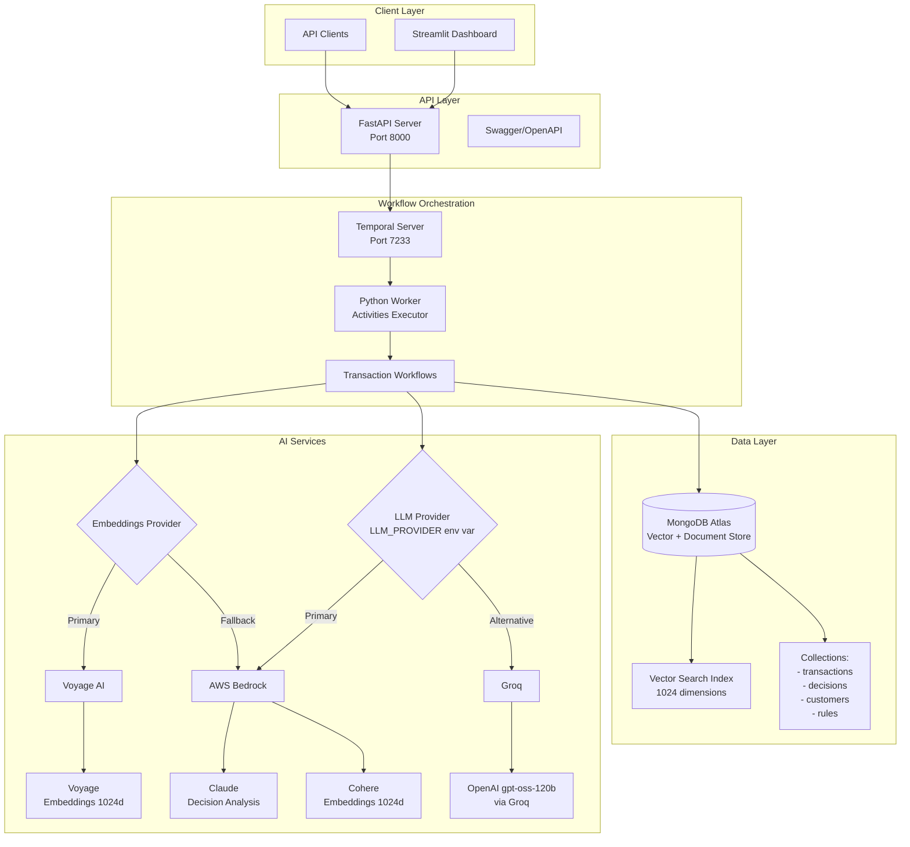
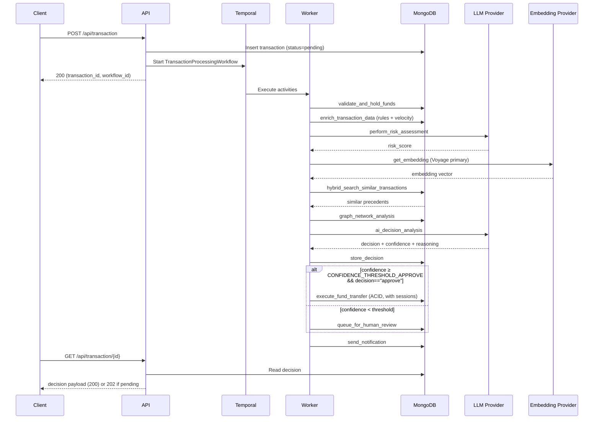
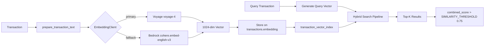
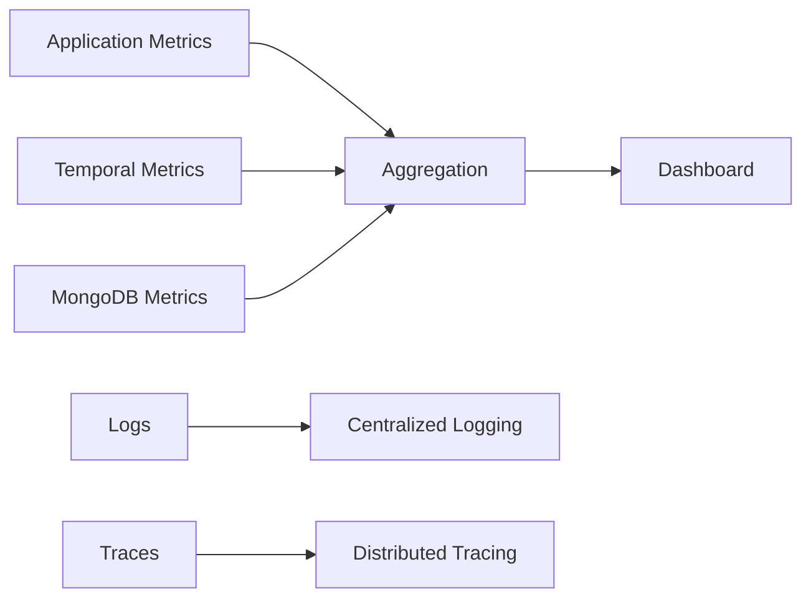

# Architecture Documentation

## System Overview

The AI-Powered Transaction Processing System is built on a microservices architecture that combines best-in-class technologies for scalable, reliable financial transaction processing. This document details the technical architecture, data flows, and integration patterns used in the PoV implementation.

## Core Architecture Diagram



## Component Architecture

### 1. API Layer (FastAPI)

**Location:** `api/main.py`

**Responsibilities:**
- REST endpoint exposure
- Request validation
- Workflow initiation
- Health monitoring

**Key Endpoints:**
```
POST /api/transaction              - Submit new transaction (returns transaction_id + workflow_id)
GET  /api/transaction/{id}         - Get AI decision for a transaction (200 with decision, 202 if pending, 404 if unknown)
GET  /api/metrics                  - Aggregate transaction & decision metrics
GET  /health                       - Service + dependency health (mongo, temporal, embedding providers)
```

The Streamlit dashboard and external clients consume the FastAPI surface
above. Human-review actions are persisted directly to MongoDB by the
workflow's `queue_for_human_review` activity and surfaced through the
dashboard rather than via a dedicated REST route.

### 2. Workflow Orchestration (Temporal)

**Location:** `temporal/workflows.py`, `temporal/activities.py`

**Workflow Definition (`TransactionProcessingWorkflow`):**

The workflow runs activities in this sequence:

1. `validate_and_hold_funds` — verify accounts exist, place a hold for the amount
2. `enrich_transaction_data` — apply rule engine, attach customer history, compute velocity metrics, surface risk flags
3. `perform_risk_assessment` — call the LLM for a risk score, run compliance checks
4. `find_similar_transactions` — embed the transaction (Voyage primary, Cohere fallback) and run hybrid search
5. `analyze_fraud_network` — graph traversal across sender/recipient accounts (`$graphLookup`)
6. `ai_decision_analysis` — combine inputs and call the LLM for the approve/reject/escalate decision
7. `store_decision` — persist the `TransactionDecision`, audit event, and update transaction status
8. `queue_for_human_review` (only if low confidence) — enqueue for the Streamlit human-review UI
9. `execute_fund_transfer` (only if approved) — ACID two-account debit/credit via MongoDB session
10. `cleanup_hold` — release the hold for non-approved decisions or on workflow failure
11. `send_notification` — record a notification document for the dashboard

Signals: `approve(manager_name)` releases a workflow waiting on the
$50k auto-approval gate; `override_decision(decision, user, reason)`
overrides the AI's verdict before completion. Query: `get_status()`
returns the in-progress workflow state plus the final `ProcessingResult`
once available.

**Temporal Features Used:**
- **Durable Execution:** Survives process crashes
- **Retry Policies:** Exponential backoff with jitter
- **Signals:** Manager approval, decision override
- **Queries:** Workflow status retrieval
- **Timeouts:** Activity-level and workflow-level

### 3. Data Layer (MongoDB Atlas)

**Database Schema** (canonical definitions in `database/schemas.py` and
`database/account_schemas.py`):

```javascript
// transactions
{
  _id: ObjectId,
  transaction_id: String,           // "TXN_YYYYMMDD_<uuid8>"
  transaction_type: String,         // "wire_transfer" | "ach" | "international"
  amount: Decimal128,               // Stored as Decimal128 for monetary precision
  currency: String,                 // ISO 4217
  sender: {
    name: String,
    country: String,
    account_number: String,
    customer_id: String
  },
  recipient: {
    name: String,
    country: String,
    account_number: String
  },
  reference_number: String,
  status: String,                   // "pending" | "processing" | "approved" | "rejected" | "escalated" | "pending_review" | "pending_manager_approval" | "completed" | "failed"
  embedding: Array[1024],           // Voyage or Cohere embedding for vector search
  embedding_model: String,          // e.g. "voyage-4" or "cohere.embed-english-v3"
  ml_features: Object,
  risk_flags: Array<String>,
  rules_applied: Array<String>,
  processing_stages: Array<Object>,
  created_at: Date,
  updated_at: Date
}

// transaction_decisions
{
  _id: ObjectId,
  decision_id: String,              // "DEC_YYYYMMDD_<uuid8>"
  transaction_id: String,
  decision: String,                 // "approve" | "reject" | "escalate" | "hold"
  confidence_score: Decimal128,     // 0-100
  risk_score: Decimal128,           // 0-100
  model_version: String,            // e.g. "openai/gpt-oss-120b" or BEDROCK_MODEL_VERSION
  processing_time_ms: Int,
  reasoning: {
    primary_reasoning: String,
    risk_factors: Array<String>,
    compliance_notes: String
  },
  similar_cases: Array<Object>,     // Top similar precedents from hybrid search
  rules_triggered: Array<String>,
  workflow_id: String,
  temporal_run_id: String,
  created_at: Date
}

// rules
{
  _id: ObjectId,
  rule_id: String,                  // "RULE_<uuid8>"
  name: String,
  description: String,
  category: String,                 // "amount" | "geography" | "pattern" | "velocity" | "compliance"
  status: String,                   // "active" | "inactive" | "testing"
  conditions: {                     // MongoDB-style condition tree
    operator: "AND" | "OR",
    conditions: Array<{ field, operator, value }>
  },
  action: String,                   // "approve" | "reject" | "escalate"
  priority: Int,                    // 0-100
  parameters: Object,
  metrics: {
    triggered_count: Int,
    true_positives: Int,
    false_positives: Int
  },
  created_at: Date,
  updated_at: Date
}
```

Other collections: `customers`, `human_reviews`, `notifications`,
`audit_events`, `system_metrics` (TTL 30 days), `accounts`,
`transaction_journal`, `balance_updates`, `balance_holds`. See
`database/connection.py` `create_indexes()` for the full index set.

**Key indexes (excerpt):**
- `transaction_id` (unique) on `transactions`, `transaction_journal`, etc.
- `(sender.customer_id, created_at)` — velocity queries
- `(sender.account_number, created_at)` and `(recipient.account_number, created_at)` — graph-traversal joins
- `(transaction_type, amount, sender.country, recipient.country)` — hybrid-search compound
- Vector search index `transaction_vector_index` on `transactions.embedding` (1024 dims, cosine)

### 4. AI Integration Layer

**LLM provider** (`ai/bedrock_client.py`, `ai/groq_client.py`):

The `LLM_PROVIDER` env var selects the backend. AWS Bedrock with Claude is the
primary supported LLM; Groq with `openai/gpt-oss-120b` is offered as an
alternative for environments without Bedrock access. Both implement the same
async `analyze_transaction(prompt)` contract returning `{decision,
confidence, reasoning, risk_factors, compliance_notes}`.

```python
# Selection logic (temporal/activities.py)
if config.LLM_PROVIDER == "groq":
    result = await groq_client.analyze_transaction(prompt)
else:
    result = await bedrock_client.analyze_transaction(prompt)
```

**Embedding provider** (`ai/embedding_client.py`):

The `EmbeddingClient` tries Voyage AI (`voyage-4`, 1024 dims) first when
`VOYAGE_API_KEY` is set, falling back to Cohere via Bedrock
(`cohere.embed-english-v3`, 1024 dims) on failure or when Voyage is
unconfigured. Output dimension is pinned to 1024 to match the Atlas
vector-search index.

```python
# Health-check shape exposed at GET /health
{
  "voyage_available": true,
  "cohere_available": true,
  "primary_model": "voyage-4",
  "available_models": ["voyage-4", "cohere.embed-english-v3"]
}
```

## Data Flow Architecture

### Transaction Processing Flow



### Vector Search Pipeline



The hybrid pipeline (`DecisionRepository.hybrid_search_similar_transactions`)
combines `$vectorSearch` with traditional index matches via `$unionWith`,
applies feature-based scoring (amount proximity, geography, type),
renormalises by active weight, and joins the resulting transactions with
their `transaction_decisions`. Filters always include
`status ∈ _DECIDED_STATUSES` so in-flight transactions are excluded as
similar-case precedents.

## Integration Patterns

### 1. Temporal Workflow Pattern

**Compensation & Rollback:**
```python
try:
    # Main transaction processing
    result = await process_transaction()
except Exception as e:
    # Compensation logic
    await reverse_fund_hold()
    await notify_failure()
    raise
```

**Retry Configuration:**
```python
retry_policy = RetryPolicy(
    initial_interval=timedelta(seconds=1),
    backoff_coefficient=2.0,
    maximum_interval=timedelta(seconds=60),
    maximum_attempts=5
)
```

### 2. MongoDB Aggregation Pipelines

**Fraud Network Detection** (canonical implementation in
`DecisionRepository.graph_network_analysis`):

```javascript
db.transactions.aggregate([
  { $match: {
      $and: [
        { $or: [
            { "sender.account_number": targetAccount },
            { "recipient.account_number": targetAccount }
        ]},
        { created_at: { $gte: cutoffDate } }
      ]
  }},
  { $graphLookup: {
      from: "transactions",
      startWith: "$recipient.account_number",
      connectFromField: "recipient.account_number",
      connectToField: "sender.account_number",
      as: "transaction_chain",
      maxDepth: 3,
      depthField: "chain_depth",
      restrictSearchWithMatch: { created_at: { $gte: cutoffDate } }
  }},
  // ... project to extract suspicious_patterns (rapid_cycling, potential_layering)
  // ... group to compute network statistics
])
```

### 3. AI Prompt Engineering

Prompt templates live in `ai/prompts.py`. The
`create_transaction_analysis_prompt` helper composes:

- Transaction details (id, type, amount as USD with Decimal128 → float
  via `from_decimal128`, sender/recipient name + country, reference)
- Type-specific risk context (wire / ACH / international)
- Similar historical cases (top 5, with their amount + decision +
  risk_score)
- 90-day customer history (count, avg amount, total volume, prior
  risk incidents)
- Decision guidelines anchored to `CONFIDENCE_THRESHOLD_APPROVE` and
  structuring detection rules

The LLM is asked to respond in JSON with the shape:

```json
{
  "decision": "approve|reject|escalate",
  "confidence": 0,
  "reasoning": "...",
  "risk_factors": ["..."],
  "compliance_notes": "..."
}
```

Both `bedrock_client._parse_claude_response` and
`groq_client._parse_llm_response` accept either raw JSON or
JSON-in-markdown (```` ```json ```` blocks), normalise legacy
`"decision": "flag"` to `"escalate"`, and coerce string confidences
(e.g. `"95%"`) to floats. A keyword-based fallback parser handles
malformed responses without raising.

## Scalability Considerations

### Current PoV Limitations

| Component | PoV Scope | Production Considerations |
|-----------|-----------|---------------------------|
| API Throughput | Basic load handling | Would require load balancing |
| Workflow Concurrency | Limited concurrent workflows | Would need worker scaling |
| MongoDB Connections | Default connection pool | Would need connection optimization |
| Vector Search | Basic indexing | Would need index optimization |
| AI Inference | Synchronous calls | Would benefit from batching |

### Production Scaling Strategy

1. **Horizontal Scaling:**
   - Deploy API servers behind load balancer
   - Multiple Temporal workers with partitioning
   - MongoDB Atlas auto-scaling clusters

2. **Caching Layer:**
   - Use a Caching layer for customer profile caching
   - Embedding cache for frequent queries
   - Decision cache for idempotency

3. **Performance Optimizations:**
   - Batch embedding generation
   - Async AI inference with queuing
   - Connection pooling for all services

## Security Architecture

### Authentication & Authorization

```
Client --> API Gateway --> JWT Validation --> Service
                |
                v
           Rate Limiting
                |
                v
            API Server
```

### Data Protection

- **Encryption at Rest:** MongoDB Atlas encryption
- **Encryption in Transit:** TLS 1.3 for all connections
- **Secrets Management:** Environment variables (PoV), AWS Secrets Manager (Production)
- **PII Handling:** Field-level encryption for sensitive data

## Monitoring & Observability

### Metrics Collection



### Key Performance Indicators

- **Transaction Processing Time:** P50, P95, P99
- **Decision Accuracy:** True/False Positive Rates
- **System Availability:** Uptime percentage
- **Queue Depth:** Human review backlog
- **Cost Metrics:** Per-transaction processing cost

## Deployment Architecture

### Docker Compose (PoV)

The PoV uses two separate compose files joined via the external
`temporal-network` bridge:

- `docker-compose/docker-compose.yml` — Temporal server, history,
  matching, frontend, web UI, PostgreSQL, Elasticsearch.
- `./docker-compose.yml` (project root) — `api`, `temporal-worker`,
  `streamlit`, all built from the project `Dockerfile`.

```yaml
# docker-compose.yml (project root)
services:
  temporal-worker:
    build: { context: ., dockerfile: Dockerfile }
    command: python -m temporal.run_worker
    env_file: [.env]

  api:
    build: { context: ., dockerfile: Dockerfile }
    command: uvicorn api.main:app --host 0.0.0.0 --port 8000 --reload
    ports: ["8000:8000"]
    env_file: [.env]

  streamlit:
    build: { context: ., dockerfile: Dockerfile }
    command: streamlit run app.py --server.port 8501 --server.address 0.0.0.0
    ports: ["8501:8501"]
    depends_on: [api]
    env_file: [.env]

networks:
  temporal-network:
    external: true
```

### Kubernetes (Production)

```yaml
Deployments:
- api-deployment (3 replicas)
- worker-deployment (5 replicas)
- dashboard-deployment (2 replicas)

Services:
- api-service (LoadBalancer)
- temporal-service (ClusterIP)
- dashboard-service (LoadBalancer)

ConfigMaps:
- app-config
- temporal-config

Secrets:
- mongodb-credentials
- aws-credentials
```

## Technology Stack Summary

Pinned versions live in `pyproject.toml` (`dependencies`).

| Layer | Technology | Version | Purpose |
|-------|------------|---------|---------|
| API | FastAPI | ≥0.116.2 | REST API framework |
| Workflow | Temporal (`temporalio` SDK) | ≥1.17.0 | Durable execution |
| Database | MongoDB Atlas | 7.0+ | Document store + vector search |
| Driver | PyMongo | ≥4.16 (native async) | Replaces motor (deprecated) |
| LLM | AWS Bedrock (Claude) | — | Primary LLM provider |
| LLM | Groq (`openai/gpt-oss-120b`) | ≥1.2.0 | Alternative LLM provider |
| Embeddings | Voyage AI (`voyage-4`) | ≥0.3.5 | Primary embedding provider, 1024 dims |
| Embeddings | AWS Bedrock (Cohere `embed-english-v3`) | — | Fallback embedding provider, 1024 dims |
| UI | Streamlit | ≥1.49.1 | Dashboard interface |
| Container | Docker + Docker Compose | 24+ | Containerization |
| Package mgr | uv | latest | Dependency + venv management |
| Language | Python | 3.13+ | Primary language |

## API Contracts

Canonical schemas live in `api/models.py`. These examples reflect the
implementation in `api/main.py`.

### POST /api/transaction

Submit a new transaction for processing. The route persists the
transaction, starts a `TransactionProcessingWorkflow`, and returns
immediately while the workflow runs asynchronously.

**Request:**
```json
{
  "transaction_type": "wire_transfer",
  "amount": 5000.00,
  "currency": "USD",
  "sender": {
    "name": "Alice Anderson",
    "country": "US",
    "account_number": "ACC-001",
    "customer_id": "CUST-001"
  },
  "recipient": {
    "name": "Bob Baker",
    "country": "GB",
    "account_number": "ACC-002"
  },
  "reference_number": "INV-12345",
  "description": "Invoice payment",
  "metadata": {}
}
```

**Response:**
```json
{
  "transaction_id": "TXN_20260511_E637A986",
  "status": "processing",
  "message": "Transaction submitted for AI analysis",
  "workflow_id": "txn-processing-TXN_20260511_E637A986"
}
```

### GET /api/transaction/{transaction_id}

Fetch the AI decision for a transaction. Returns `200` once the
workflow has stored a decision, `202` if still pending, `404` if the
transaction id is unknown.

**Response (200):**
```json
{
  "transaction_id": "TXN_20260511_E637A986",
  "decision": "approve",
  "confidence": 92.5,
  "risk_score": 25.0,
  "reasoning": "Low risk transaction with verified customer",
  "processing_time_ms": 4120,
  "risk_factors": []
}
```

### GET /api/metrics

Aggregate counts and averages across the `transactions` and
`transaction_decisions` collections.

**Response:**
```json
{
  "total_transactions": 57,
  "transactions_by_type": {"wire_transfer": 21, "international": 10, "ach": 26},
  "decisions_breakdown": {"approve": 28, "reject": 3, "escalate": 26},
  "average_processing_time_ms": 13212.4,
  "average_confidence": 80.16,
  "total_amount_processed": 2374076.93
}
```

### GET /health

Liveness + dependency status.

**Response:**
```json
{
  "status": "healthy",
  "timestamp": "2026-05-11T10:47:45.522207+00:00",
  "mongodb": "connected",
  "temporal": "connected",
  "embedding": {
    "primary_model": "voyage-4",
    "voyage_available": true,
    "cohere_available": true,
    "available_models": ["voyage-4", "cohere.embed-english-v3"]
  }
}
```

## Database Optimization

### Index Strategy

Indexes are created idempotently on startup by
`database/connection.py::create_indexes()`. The full list is the source
of truth; key shapes:

1. **Unique single-field indexes**:
   - `transactions.transaction_id`
   - `customers.customer_id`, `accounts.account_number`,
     `rules.rule_id`, `notifications.notification_id`,
     `transaction_journal.journal_id`, `balance_updates.update_id`,
     `balance_holds.hold_id`

2. **Compound indexes (ESR-aware):**
   - `(sender.customer_id, created_at desc)` — `velocity_by_customer_index`
   - `(sender.account_number, created_at desc)` — `graph_sender_time_index`
   - `(recipient.account_number, created_at desc)` — `graph_recipient_time_index`
   - `(transaction_type, amount, sender.country, recipient.country)` — `hybrid_search_index`
   - `(account_number, timestamp desc)` on journal/balance_updates
   - `(status, created_at desc)` on transactions/notifications/decisions

3. **TTL indexes:**
   - `system_metrics.timestamp` (expires after 30 days)
   - `balance_holds.expires_at` (drives hold expiry)

4. **Vector search index** (`transaction_vector_index`):
   ```javascript
   {
     "mappings": {
       "fields": {
         "embedding": {
           "type": "knnVector",
           "dimensions": 1024,
           "similarity": "cosine"
         }
       }
     }
   }
   ```

## Error Handling Strategy

### Activity-Level Errors

```python
@activity.defn
async def process_transaction(input: TransactionInput) -> TransactionResult:
    try:
        # Main processing logic
        return result
    except Exception as e:
        # Retriable errors (network, timeout)
        raise ApplicationError(str(e), non_retryable=False)
```

### Workflow-Level Compensation

```python
async def execute_with_compensation(ctx):
    try:
        result = await ctx.execute_activity(process_payment)
        return result
    except Exception as e:
        # Compensation logic
        await ctx.execute_activity(reverse_payment)
        await ctx.execute_activity(notify_failure)
        raise
```

## Performance Benchmarks

### PoV Performance Characteristics

| Operation | Description | Notes |
|-----------|-------------|-------|
| API Request | REST endpoint processing | FastAPI async handling |
| Workflow Execution | End-to-end transaction processing | Includes all activities |
| Vector Search | Similarity matching | 1024-dimensional vectors |
| AI Analysis | Bedrock API calls | Claude and Cohere models |
| MongoDB Operations | CRUD operations | Using connection pooling |

## Conclusion

This architecture provides a robust foundation for a production-ready transaction processing system. The combination of Temporal's reliability, MongoDB's flexibility, and AI-powered decision making creates a system that can scale to meet enterprise demands while maintaining high accuracy and compliance standards.

The PoV implementation demonstrates all critical capabilities while clearly identifying areas for production hardening and optimization.